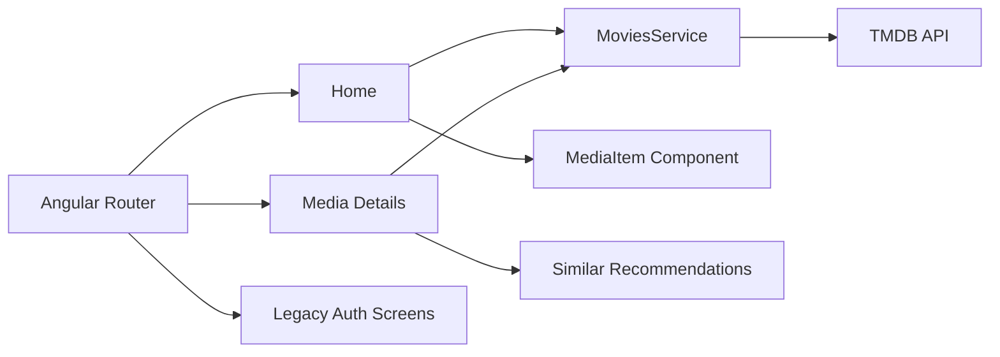

# Movie Explorer — Angular Portfolio App

[](https://angular.dev/)
[](https://www.typescriptlang.org/)

**Live demo:** https://movie-mu-wine.vercel.app

Movie Explorer is an Angular portfolio application for browsing trending movies, TV shows, and people using The Movie Database (TMDB) API. It includes media details, similar recommendations, client-side movie search, responsive layouts, and optional legacy authentication screens.

## Core features

- Trending movies, TV shows, and people from TMDB
- Shared media-card component for reusable catalog rendering
- Movie/person detail pages
- Similar-media recommendations
- Client-side movie title search on the home page
- Responsive Bootstrap layout
- Public portfolio browsing without a login requirement
- Login/register screens retained as a legacy demo flow

## Portfolio boundaries

This is a front-end portfolio project rather than a production streaming platform:

- Media data comes from TMDB; there is no custom movie backend.
- Authentication screens use an older external demo API and are not required to browse the portfolio.
- No video streaming or paid subscription flow is implemented.
- Search is currently client-side and scoped to the trending movie list.
- TMDB data is fetched directly from the browser.

## Architecture at a glance



## Recruiter quick scan

- Angular routing across catalog and detail views
- Reusable media-card component
- REST API integration with Angular HttpClient
- Responsive Bootstrap UI
- Route-aware detail loading when URL parameters change
- Public demo flow that can be reviewed without account creation
- Clear separation between current portfolio functionality and legacy auth demo screens
- Live deployment on Vercel

## Tech stack

- Angular 14
- TypeScript 4.7
- RxJS
- Angular Router
- Angular HttpClient
- Bootstrap 5
- Font Awesome
- Jasmine + Karma scaffold
- TMDB API

## Project structure

```text
src/app/
├── home/             # Trending catalog
├── mediaitem/        # Reusable movie / TV / person card
├── moviedetails/     # Details and similar recommendations
├── navbar/           # Main navigation
├── movies.service.ts # TMDB HTTP integration
├── search.pipe.ts    # Client-side movie title search
├── login/            # Legacy authentication demo
├── register/         # Legacy authentication demo
└── app-routing.module.ts
```

## Run locally

Requirements: Node.js 16 and npm.

```bash
git clone https://github.com/SamirNexus/Movie.git
cd Movie
npm install
npm start
```

Open `http://localhost:4200/`.

## Quality checks

```bash
npm run build
npm test
```

GitHub Actions validates the production build on pushes and pull requests.

## Portfolio highlights

- Built a multi-view Angular media browsing experience around a public REST API
- Reused a shared media-card component across movies, TV shows, and people
- Added dynamic detail pages and similar-media recommendations
- Improved portfolio reviewability by removing the login requirement from browsing routes
- Updated detail loading to respond to route parameter changes
- Deployed the app with Vercel

## Author

**Mohamed Samir** — Front-End Developer  
[GitHub](https://github.com/SamirNexus) · [LinkedIn](https://www.linkedin.com/in/samirnexus98/)
